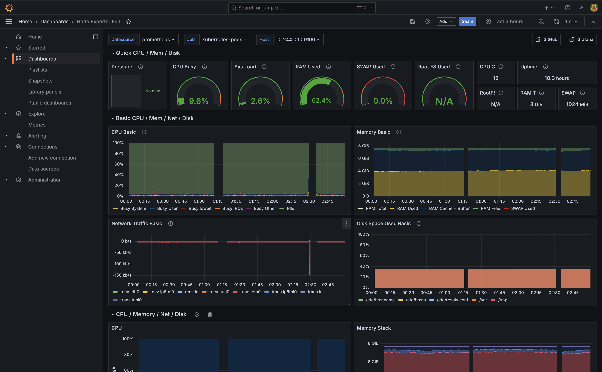

# One2n-Assignment
This folder conatins the solution for the bootcamp milestone-11. 

### Problem Statement:
Link for PS: https://one2n.notion.site/11-Configure-dashboards-alerts-d0dda64e51b24db4a62d86864bc3c624
### Pre-Requisites:
* minikube 
* docker-desktop/virtualbox (I have used docker desktop to setup the k8s cluster but 
you can use virtualbox also) 
* kubectl
* helm
* Your application stack shoulb be up a and running

### How to start the multinode cluster using minikube 
Please make sure you have minikube & docker-desktop installed in you localhost and your application stack should be up and running

Below is the sequence in which we have to run the manifest files to get this Milestone code up and running.


* **alertmanager.yml**: Use this file to setup the Alert manager for sending out email
```bash
kubectl apply -f alertmanager.yml
```
* **node-exporter.yml**: Use this file to setup the node-exporter on every k8s node
```bash
kubectl apply -f node-exporter.yml
```
* **prometheus.yml**: Use this file to add the alertrule in the Prometheus  
```bash 
kubectl apply -f prometheus.yml
```

## Screenshots of Grafana Dashboards and Alerts to show the working of the code

1 - Dashboard for Blackbox 


2 - Dashboard for node-exporter


3 - Dashboard for Application Error Logs 


4 - Dashboard for Kube-state-metric


5 - Slack alert notification


6 - Email alert notification
