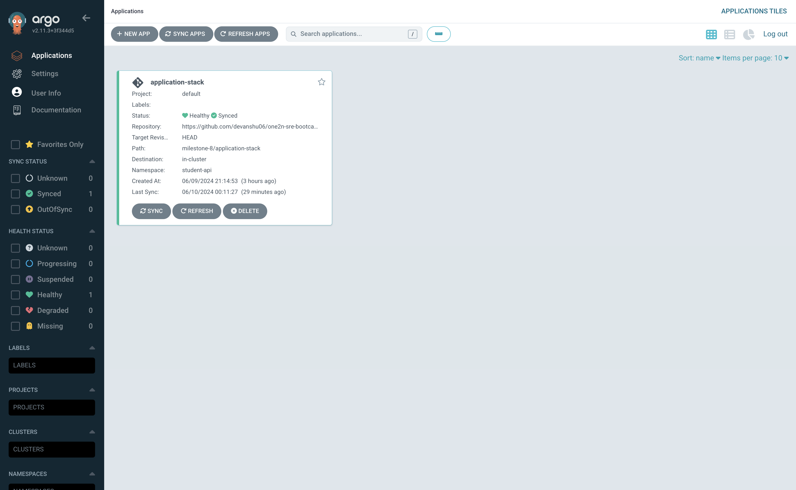
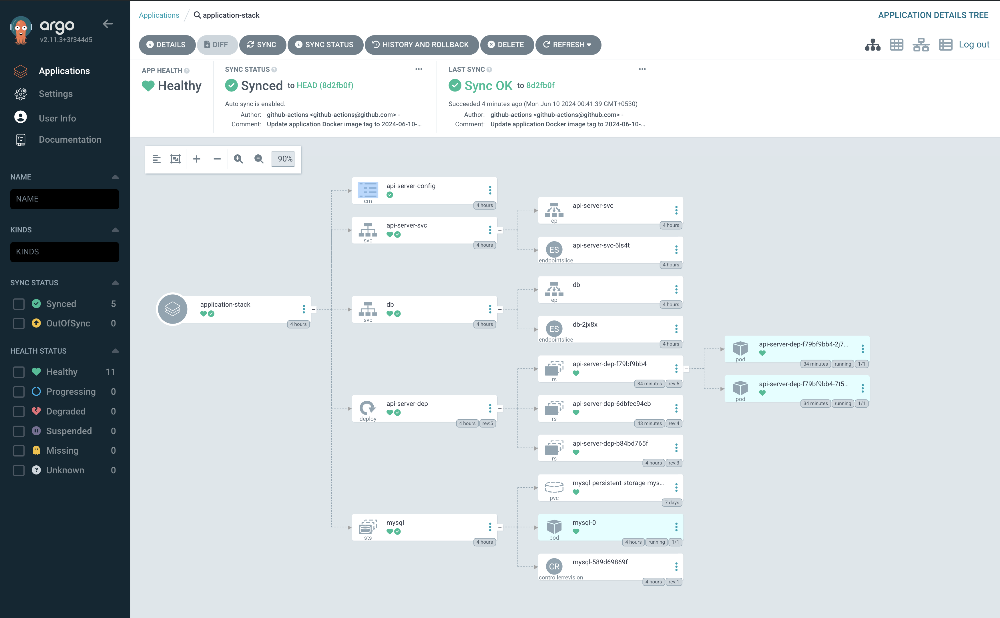
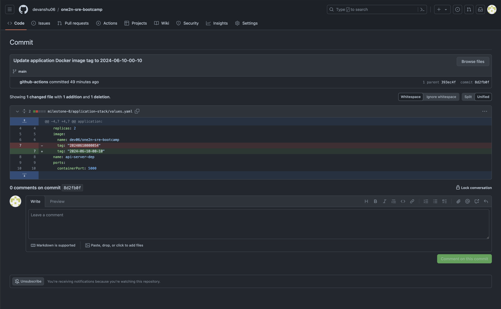
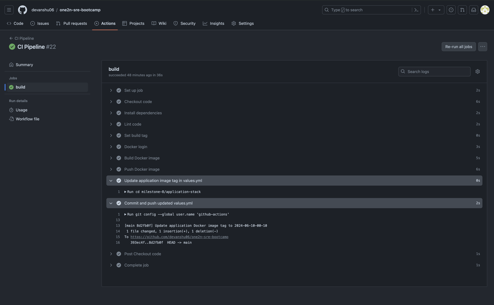

# One2n-Assignment
This folder conatins the solution for the bootcamp milestone-9. 

### Problem Statement:
Link for PS: https://one2n.notion.site/9-Setup-one-click-deployments-using-ArgoCD-24d589ba6eb74bc6a53d2a914f1527bf
### Pre-Requisites:
* minikube 
* docker-desktop/virtualbox (I have used docker desktop to setup the k8s cluster but 
you can use virtualbox also) 
* kubectl
 
### How to start the multinode cluster using minikube 
Please make sure you have minikube & docker-desktop installed in you localhost.

Below is the sequence in which we have to run the manifest files to get this Milestone code up and running.


* **namespace.yml**: Use this file to create a argocd namespace
```bash
kubectl apply -f namespace.yml
```
* **argocd-manifest.yml**: Use this file to setup the argocd on the k8s cluster
```bash
kubectl apply -f argocd-manifest.yml
```

# Explanation:

* I have set up the git repository and installed Argocd in order to use Helm to build the app that is committed in Milestone 8. Argocd has auto sync enabled, thus any changes to the file will be deployed.
* The github-action pipeline builds and pushes the docker image in the dockerhub repository and updates the values when you initiate a fresh build using the github-action from the code saved in milestone-4.The milestone-8/application-stack has a values.yaml file. Therefore, the argocd will detect and deploy any updates to the file under milestone-8/application-stack. 

## Screenshots of application deployed using ArgoCD 
1 - Argocd application 


2 - Argocd Application View


3 - Image tag in values.yml getting updated after creating build and commiting it to the repository


